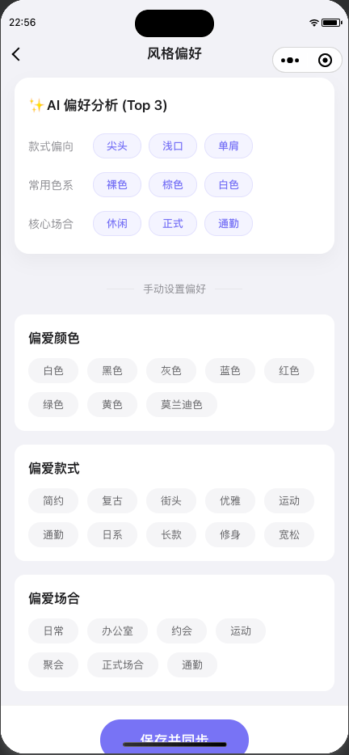
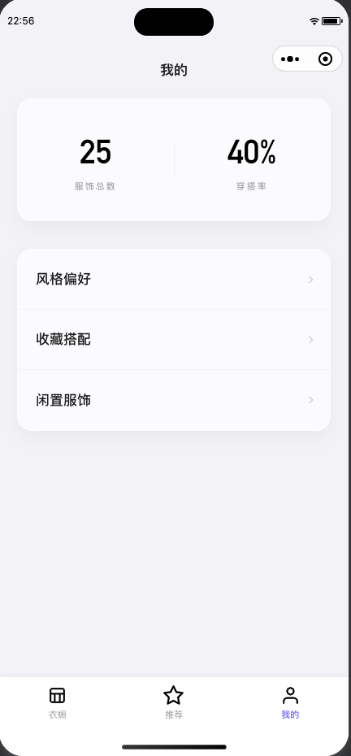

# AI OOTD

AI OOTD 是一个基于微信小程序云开发的智能穿搭助手，用来管理数字衣橱、理解个人偏好，并结合天气与库存生成可执行的穿搭推荐。

项目定位兼顾作品展示与工程落地：既能直观看到页面效果，也保留了本地运行、云函数和 AI 配置所需的关键信息。

## 项目亮点

- 🤖 AI 识别服饰图片，支持多件单品拆分与结构化打标。
- 🌦️ 结合天气、聊天意图和衣橱库存生成穿搭推荐。
- 🧠 通过收藏、喜欢、已穿等行为持续学习用户偏好。
- 👚 提供衣橱管理、闲置服饰、风格偏好和推荐反馈闭环。
- ☁️ 基于微信云开发实现云函数、数据库和云存储一体化。

## 页面展示

| 页面 | 预览 |
| --- | --- |
| **👚 衣橱服饰**<br>支持查看衣橱单品、按品类和季节筛选，并进行日常管理。 |  |
| **🪄 AI 穿搭推荐**<br>通过自然语言发起穿搭请求，结合天气与库存生成推荐结果。 |  |
| **💬 推荐反馈**<br>用户可以对推荐结果执行换一套、喜欢、收藏、穿这套等反馈操作。 |  |
| **🎨 风格偏好**<br>根据真实使用行为沉淀个人风格画像，形成可视化偏好面板。 |  |
| **📊 个人统计与闲置服饰**<br>展示服饰数量、利用率等统计信息，并辅助识别长期闲置单品。 |  |

## 核心能力

### 🤳 智能服饰识别

- 使用多模态模型识别服饰图片。
- 自动抽取品类、颜色、款式、季节、场合、材质等属性。
- 识别时参考用户已有标签，减少近义词和冗余标签污染。

### 🗣️ 对话式穿搭推荐

- 接收用户的场景描述，例如通勤、周末、随机穿搭。
- 读取当前天气和衣橱库存，生成可展示的搭配结果。
- 支持在推荐结果上继续追问，实现多轮调整。

### ❤️ 偏好学习闭环

- 将喜欢、收藏、已穿等行为转化为偏好信号。
- 为后续推荐提供更贴近个人风格的依据。

### 🧺 数字衣橱管理

- 管理服饰资产，查看详情与历史使用情况。
- 辅助发现闲置服饰，提升衣橱利用率。

## 🛠️ 技术栈

- 前端：微信小程序原生框架、TypeScript、SCSS
- 后端：微信云开发、云函数、云数据库、云存储
- AI：Ark 大模型接口
- 外部能力：天气服务

## 项目结构

```text
miniprogram-1/
├── miniprogram/         # 小程序前端代码
├── cloudfunctions/      # 云函数
│   ├── ai/              # AI 识别与推荐
│   ├── clothing/        # 衣橱相关逻辑
│   ├── outfit/          # 搭配反馈与收藏
│   ├── user/            # 用户偏好数据
│   └── weather/         # 天气信息
├── documents/images/    # README 展示截图
└── project.config.json  # 微信开发者工具配置
```

## 快速启动

### 1. 导入项目

使用微信开发者工具打开项目根目录：

```text
/Users/taibaijiang/WeChatProjects/miniprogram-1
```

### 2. 配置云开发环境

- 创建并绑定你自己的云开发环境。
- 根据 `cloudfunctions/database-init` 初始化所需集合。
- 在开发者工具中为相关云函数安装依赖并部署。

### 3. 配置 AI 服务

`cloudfunctions/ai/index.js` 会读取以下环境变量：

- `ARK_API_KEY`
- `ARK_BASE_URL`
- `AI_MODEL`
- `AI_VISION_MODEL`

如果这些变量未正确注入到云函数运行环境，推荐与识图能力会失败。

### 4. 编译预览

- 编译小程序。
- 部署 `ai`、`clothing`、`outfit`、`user`、`weather` 等云函数。
- 在模拟器或真机中测试衣橱、推荐和反馈链路。
